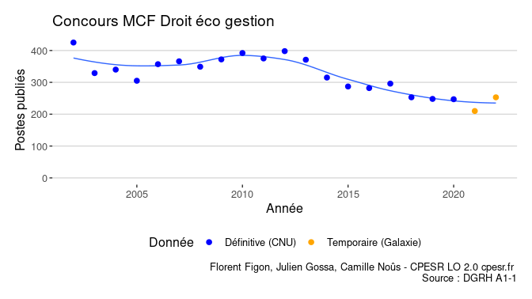
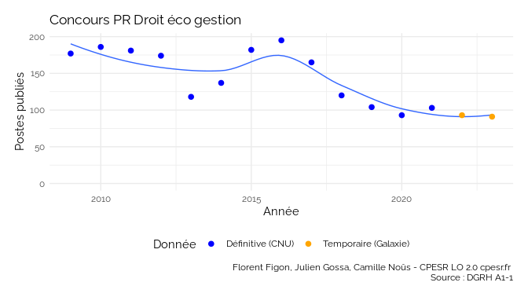
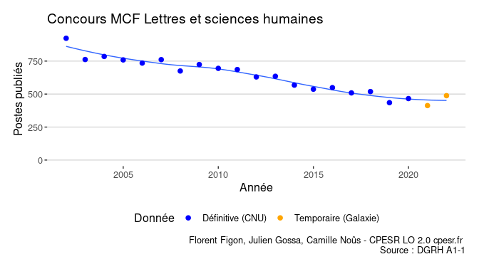
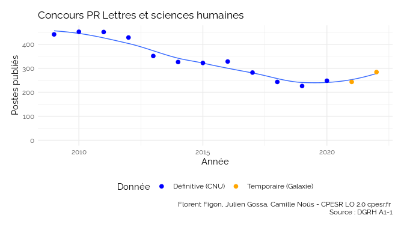
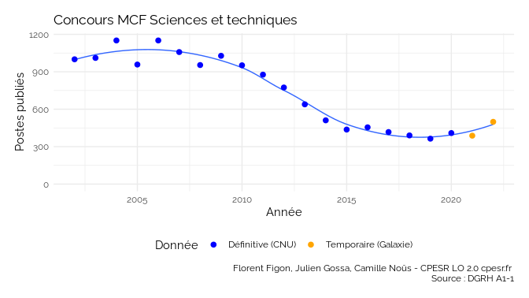
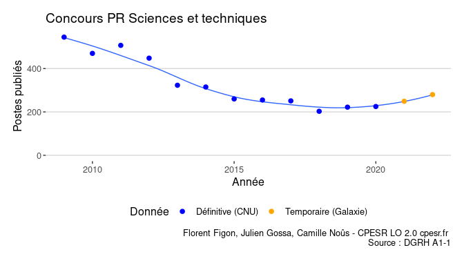
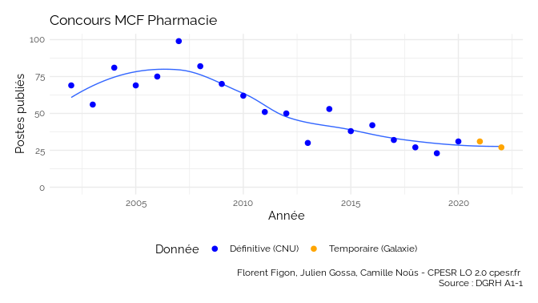
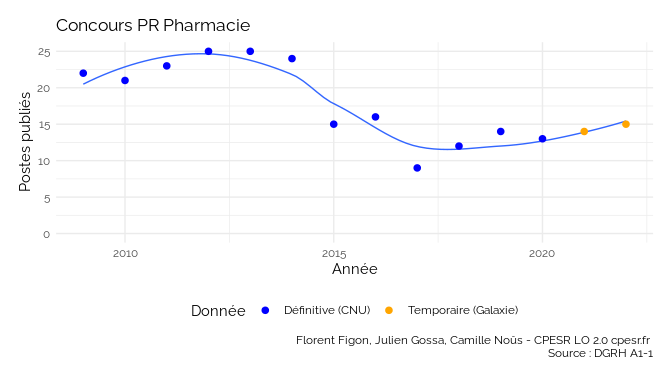

Nombre de postes depuis 2002 pour les sections CNU
================

    - twtexte:[#DataESR] Evolution du nombre de postes d'enseignant-chercheur
    - twalt:@ffigon @juliengossa LO 2.0 www.cpesr.fr
    - twurl:https://twitter.com/CPESR_/status/1498228236710559744

## Concours de Maître de Conférences

<!-- -->

## Concours de Professeur des universités

<!-- -->

## MCF en Droit éco gestion

<!-- -->

## PR en Droit éco gestion

<!-- -->

## MCF en Lettres et sciences humaines

<!-- -->

## PR en Lettres et sciences humaines

<!-- -->

## MCF en Sciences et techniques

<!-- -->

## PR en Sciences et techniques

<!-- -->

## MCF en Pharmacie

<!-- -->

## PR en Pharmacie

<!-- -->

## MCF Section CNU 1 Droit privé et sciences criminelles

<!-- -->

## PR Section CNU 1 Droit privé et sciences criminelles

<!-- -->

## MCF Section CNU 2 Droit public

<!-- -->

## PR Section CNU 2 Droit public

<!-- -->

## MCF Section CNU 3 Histoire du droit et des institutions

<!-- -->

## PR Section CNU 3 Histoire du droit et des institutions

<!-- -->

## MCF Section CNU 4 Science politique

<!-- -->

## PR Section CNU 4 Science politique

<!-- -->

## MCF Section CNU 5 Sciences économiques

<!-- -->

## PR Section CNU 5 Sciences économiques

<!-- -->

## MCF Section CNU 6 Sciences de gestion

<!-- -->

## PR Section CNU 6 Sciences de gestion

<!-- -->

## MCF Section CNU 7 Sciences du langage : linguistique et phonétique générales

<!-- -->

## PR Section CNU 7 Sciences du langage : linguistique et phonétique générales

<!-- -->

## MCF Section CNU 8 Langues et littératures anciennes

<!-- -->

## PR Section CNU 8 Langues et littératures anciennes

<!-- -->

## MCF Section CNU 9 Langue et littérature françaises

<!-- -->

## PR Section CNU 9 Langue et littérature françaises

<!-- -->

## MCF Section CNU 10 Littératures comparées

<!-- -->

## PR Section CNU 10 Littératures comparées

<!-- -->

## MCF Section CNU 11 Langues et littératures anglaises et anglo-saxonnes

<!-- -->

## PR Section CNU 11 Langues et littératures anglaises et anglo-saxonnes

<!-- -->

## MCF Section CNU 12 Langues et littératures germaniques et scandinaves

<!-- -->

## PR Section CNU 12 Langues et littératures germaniques et scandinaves

<!-- -->

## MCF Section CNU 13 Langues et littératures slaves

<!-- -->

## PR Section CNU 13 Langues et littératures slaves

<!-- -->

## MCF Section CNU 14 Langues et littératures romanes : espagnol, italien, portugais, autres langues romanes

<!-- -->

## PR Section CNU 14 Langues et littératures romanes : espagnol, italien, portugais, autres langues romanes

<!-- -->

## MCF Section CNU 15 Langues et littératures arabes, chinoises, japonaises, hébraïques, d autres domaines linguistiques

<!-- -->

## PR Section CNU 15 Langues et littératures arabes, chinoises, japonaises, hébraïques, d autres domaines linguistiques

<!-- -->

## MCF Section CNU 16 Psychologie et Ergonomie

<!-- -->

## PR Section CNU 16 Psychologie et Ergonomie

<!-- -->

## MCF Section CNU 17 Philosophie

<!-- -->

## PR Section CNU 17 Philosophie

<!-- -->

## MCF Section CNU 18 Architecture et Arts : plastiques, du spectacle, musique, musicologie, esthétique, sciences de l’art

<!-- -->

## PR Section CNU 18 Architecture et Arts : plastiques, du spectacle, musique, musicologie, esthétique, sciences de l’art

<!-- -->

## MCF Section CNU 19 Sociologie, démographie

<!-- -->

## PR Section CNU 19 Sociologie, démographie

<!-- -->

## MCF Section CNU 20 Anthropologie biologique, ethnologie, préhistoire

<!-- -->

## PR Section CNU 20 Anthropologie biologique, ethnologie, préhistoire

<!-- -->

## MCF Section CNU 21 Histoire et civilisations : histoire et archéologie des mondes anciens et des mondes médiévaux, de l’art

<!-- -->

## PR Section CNU 21 Histoire et civilisations : histoire et archéologie des mondes anciens et des mondes médiévaux, de l’art

<!-- -->

## MCF Section CNU 22 Histoire et civilisations : histoire des mondes modernes, histoire du monde contemporain, de l’art, de la musique

<!-- -->

## PR Section CNU 22 Histoire et civilisations : histoire des mondes modernes, histoire du monde contemporain, de l’art, de la musique

<!-- -->

## MCF Section CNU 23 Géographie physique, humaine, économique et régionale

<!-- -->

## PR Section CNU 23 Géographie physique, humaine, économique et régionale

<!-- -->

## MCF Section CNU 24 Aménagement de l’espace, urbanisme

<!-- -->

## PR Section CNU 24 Aménagement de l’espace, urbanisme

<!-- -->

## MCF Section CNU 25 Mathématiques

<!-- -->

## PR Section CNU 25 Mathématiques

<!-- -->

## MCF Section CNU 26 Mathématiques appliquées et applications des mathématiques

<!-- -->

## PR Section CNU 26 Mathématiques appliquées et applications des mathématiques

<!-- -->

## MCF Section CNU 27 Informatique

<!-- -->

## PR Section CNU 27 Informatique

<!-- -->

## MCF Section CNU 28 Milieux denses et matériaux

<!-- -->

## PR Section CNU 28 Milieux denses et matériaux

<!-- -->

## MCF Section CNU 29 Constituants élémentaires

<!-- -->

## PR Section CNU 29 Constituants élémentaires

<!-- -->

## MCF Section CNU 30 Milieux dilués et optique

<!-- -->

## PR Section CNU 30 Milieux dilués et optique

<!-- -->

## MCF Section CNU 31 Chimie théorique, physique, analytique

<!-- -->

## PR Section CNU 31 Chimie théorique, physique, analytique

<!-- -->

## MCF Section CNU 32 Chimie organique, inorganique, industrielle

<!-- -->

## PR Section CNU 32 Chimie organique, inorganique, industrielle

<!-- -->

## MCF Section CNU 33 Chimie des matériaux

<!-- -->

## PR Section CNU 33 Chimie des matériaux

<!-- -->

## MCF Section CNU 34 Astronomie, astrophysique

<!-- -->

## PR Section CNU 34 Astronomie, astrophysique

<!-- -->

## MCF Section CNU 35 Structure et évolution de la Terre et des autres planètes

<!-- -->

## PR Section CNU 35 Structure et évolution de la Terre et des autres planètes

<!-- -->

## MCF Section CNU 36 Terre solide : géodynamique des enveloppes supérieures, paléobiosphère

<!-- -->

## PR Section CNU 36 Terre solide : géodynamique des enveloppes supérieures, paléobiosphère

<!-- -->

## MCF Section CNU 37 Météorologie, océanographie physique et physique de l’environnement

<!-- -->

## PR Section CNU 37 Météorologie, océanographie physique et physique de l’environnement

<!-- -->

## MCF Section CNU 60 Mécanique, génie mécanique, génie civil

<!-- -->

## PR Section CNU 60 Mécanique, génie mécanique, génie civil

<!-- -->

## MCF Section CNU 61 Génie informatique, automatique et traitement du signal

<!-- -->

## PR Section CNU 61 Génie informatique, automatique et traitement du signal

<!-- -->

## MCF Section CNU 62 Énergétique, génie des procédés

<!-- -->

## PR Section CNU 62 Énergétique, génie des procédés

<!-- -->

## MCF Section CNU 63 Génie Électrique, Électronique, optronique et systèmes

<!-- -->

## PR Section CNU 63 Génie Électrique, Électronique, optronique et systèmes

<!-- -->

## MCF Section CNU 64 Biochimie et biologie moléculaire

<!-- -->

## PR Section CNU 64 Biochimie et biologie moléculaire

<!-- -->

## MCF Section CNU 65 Biologie cellulaire

<!-- -->

## PR Section CNU 65 Biologie cellulaire

<!-- -->

## MCF Section CNU 66 Physiologie

<!-- -->

## PR Section CNU 66 Physiologie

<!-- -->

## MCF Section CNU 67 Biologie des populations et écologie

<!-- -->

## PR Section CNU 67 Biologie des populations et écologie

<!-- -->

## MCF Section CNU 68 Biologie des organismes

<!-- -->

## PR Section CNU 68 Biologie des organismes

<!-- -->

## MCF Section CNU 69 Neurosciences

<!-- -->

## PR Section CNU 69 Neurosciences

<!-- -->

## MCF Section CNU 70 Sciences de l’éducation

<!-- -->

## PR Section CNU 70 Sciences de l’éducation

<!-- -->

## MCF Section CNU 71 Sciences de l’information et de la communication

<!-- -->

## PR Section CNU 71 Sciences de l’information et de la communication

<!-- -->

## MCF Section CNU 72 Épistémologie, histoire des sciences et des techniques

<!-- -->

## PR Section CNU 72 Épistémologie, histoire des sciences et des techniques

<!-- -->

## MCF Section CNU 73 Cultures et langues régionales

<!-- -->

## PR Section CNU 73 Cultures et langues régionales

<!-- -->

## MCF Section CNU 74 Sciences et techniques des activités physiques et sportives

<!-- -->

## PR Section CNU 74 Sciences et techniques des activités physiques et sportives

<!-- -->

## MCF Section CNU 85 Sciences physico-chimiques et ingénierie appliquée à la santé

<!-- -->

## PR Section CNU 85 Sciences physico-chimiques et ingénierie appliquée à la santé

<!-- -->

## MCF Section CNU 86 Sciences du médicament et des autres produits de santé

<!-- -->

## PR Section CNU 86 Sciences du médicament et des autres produits de santé

<!-- -->

## MCF Section CNU 87 Sciences biologiques, fondamentales et cliniques

<!-- -->

## PR Section CNU 87 Sciences biologiques, fondamentales et cliniques

<!-- -->

## MCF Section CNU 76 Théologie catholique

<!-- -->

## PR Section CNU 76 Théologie catholique

<!-- -->

## MCF Section CNU 77 Théologie protestante

<!-- -->

## PR Section CNU 77 Théologie protestante

<!-- -->
