Emploi des enseignants-chercheurs
================

## Series de données principales

-   Données originales :
    -   [Fiches démographique du
        CNU](https://www.enseignementsup-recherche.gouv.fr/cid85103/www.enseignementsup-recherche.gouv.fr/cid85103/fiches-demographiques-des-sections-de-sciences-2013.html)
    -   [Bilans de campagne de
        recrutement](https://www.enseignementsup-recherche.gouv.fr/cid118435/personnels-enseignants-du-superieur-bilans-et-statistiques.html#recrutement)
-   Données aggrégées :
    -   [cpesr-emplois-cnu-qualification-concours.csv](../data/cpesr-emplois-cnu-qualification-concours.csv)
    -   [cpesr-emplois-ec.csv](cpesr-emplois-ec.csv)

### Toutes disciplines confondues

<!-- -->

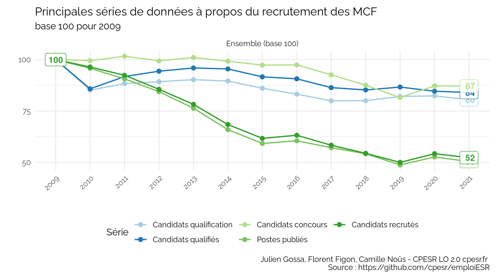<!-- -->

### Par secteur disciplinaire

<!-- -->

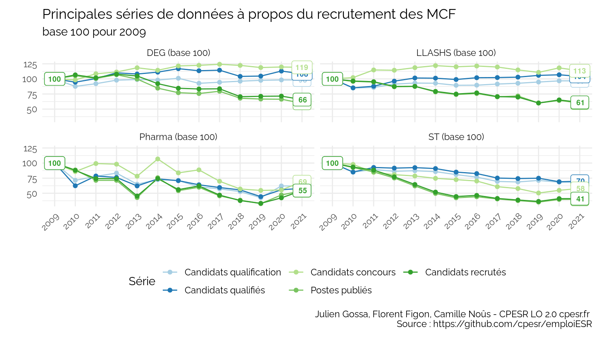<!-- -->

## Métriques

### Tension à l’entrée dans la carrière d’enseignant-chercheur

Définition : nombre de candidat⋅e⋅s par poste publié au concours.
<!-- --><!-- --><!-- -->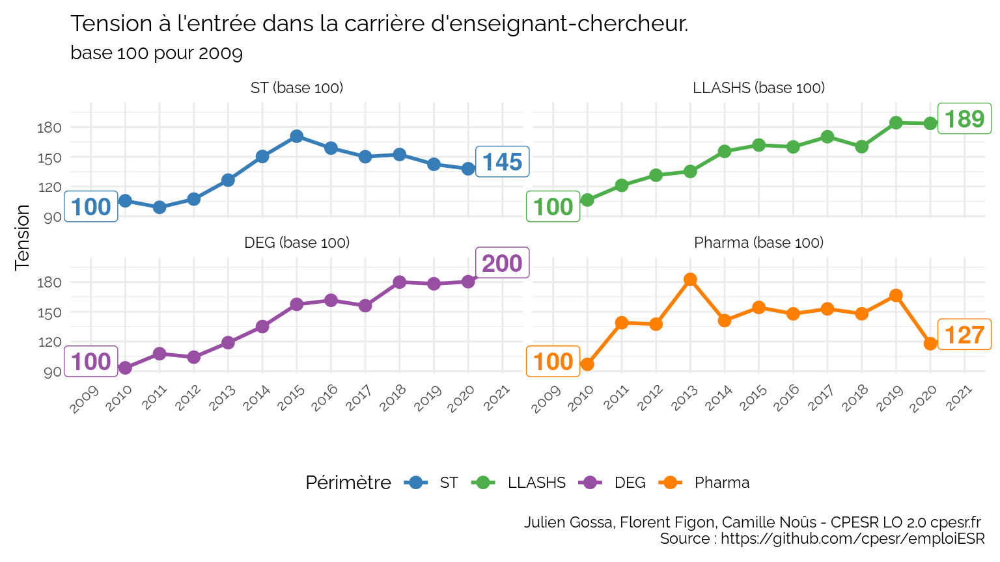<!-- -->

### Taux de réussite à l’entrée dans la carrière d’enseignant-chercheur

Définition : nombre de postes publiés au concours par candidat⋅e.
<!-- --><!-- --><!-- -->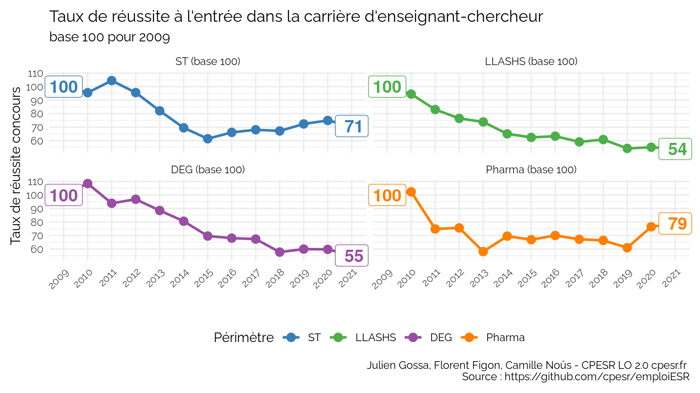<!-- -->

### Candidats sans poste à l’entrée dans la carrière d’enseignant-chercheur

Définition : différence entre le nombre de candidats et le nombre de
postes publiés au concours.
<!-- --><!-- --><!-- -->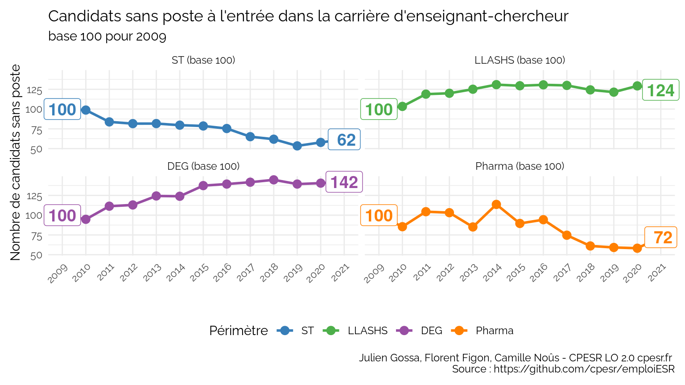<!-- -->

### Taux de réussite à l’entrée dans la carrière d’enseignant-chercheur

Définition : nombre de postes publiés au concours par candidat à la
qualification.
<!-- -->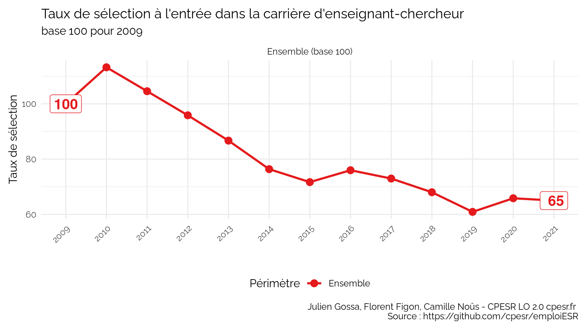<!-- --><!-- --><!-- -->

### Taux de sélection par la qualification à l’entrée dans la carrière d’enseignant-chercheur

Définition : nombre de qualifiés par candidat à la qualification.
<!-- --><!-- --><!-- --><!-- -->

### Taux de sélection par le concours à l’entrée dans la carrière d’enseignant-chercheur

Définition : nombre de postes publiés au concours par qualifié.
<!-- --><!-- -->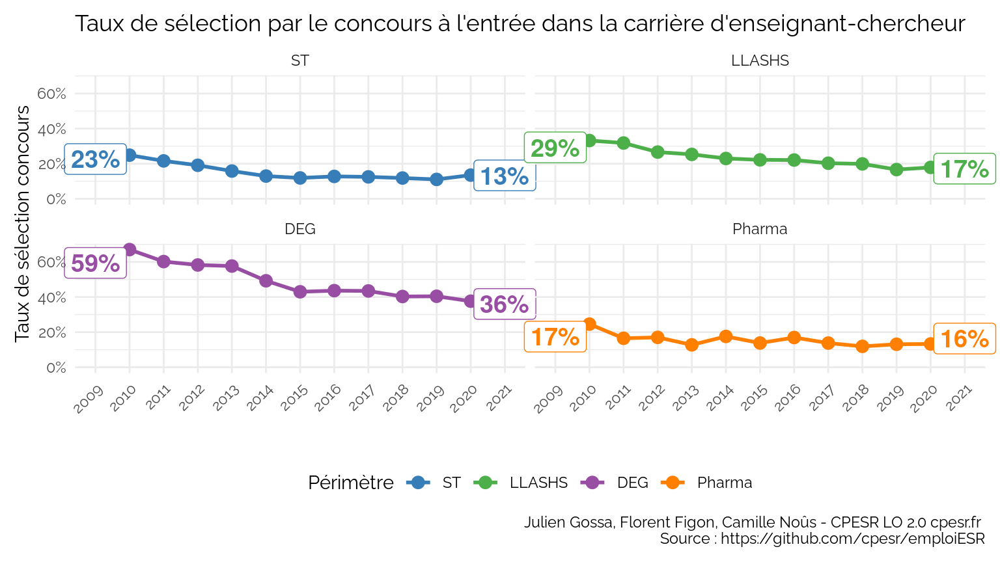<!-- -->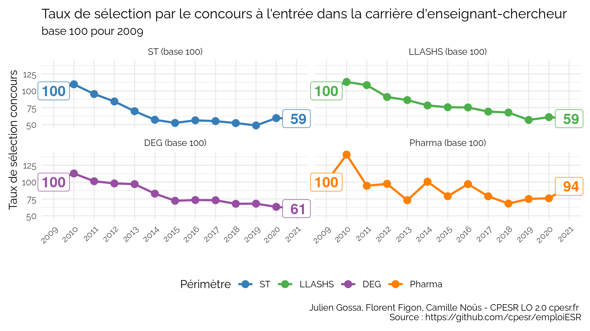<!-- -->

### Equilibre de la sélection qualification/concours à l’entrée dans la carrière d’enseignant-chercheur

Définition : nombre de candidats évincés par la qualification par le
nombre de candidats évincés par la qualification et le concours.  
<!-- -->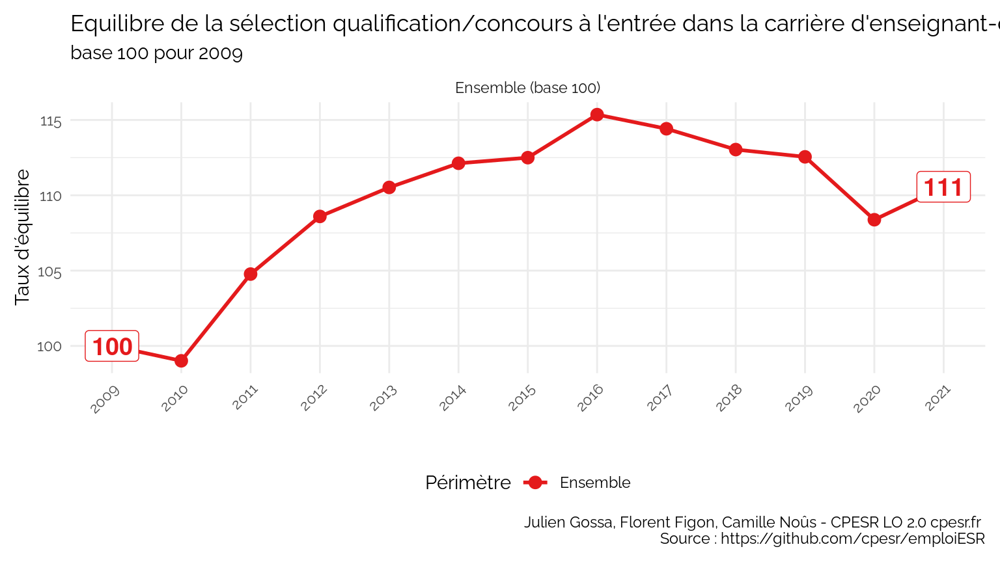<!-- --><!-- --><!-- -->

### Période nécessaire au renouvellement des effectifs enseignant-chercheur titulaire

Définition : effectifs enseignants-chercheurs titulaires par poste
publié. Il mesure le nombre d’années nécessaires au renouvellement de la
totalité des effectifs actuels, au rythme de recrutement actuel.
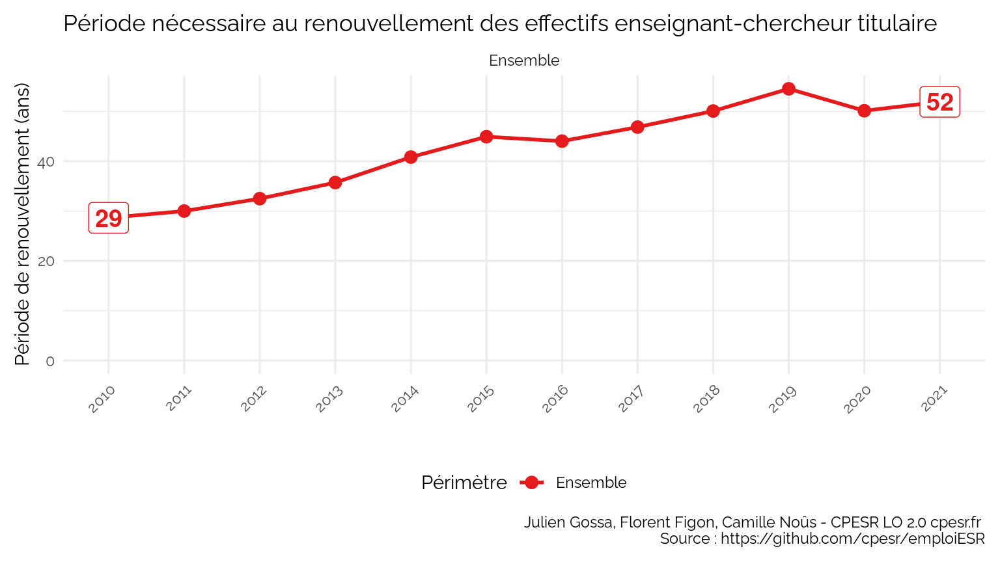<!-- -->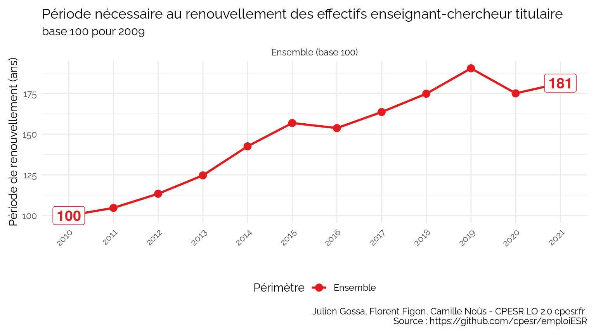<!-- --><!-- --><!-- -->
